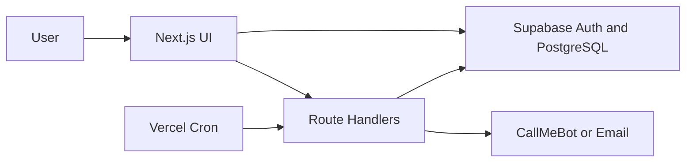

# Architecture

## Pattern

Use a modular monolith: Next.js UI, Route Handlers, and Supabase in one deployable application. Server Components load protected pages; Client Components are used for interactive forms, filters, and charts.

## Rules

- UI validates input for feedback; API and database validate it for security.
- RLS is the final authorization boundary.
- Scheduled alert processing runs on the server only.
- Use database views or server aggregations for reports, not large client-side calculations.

