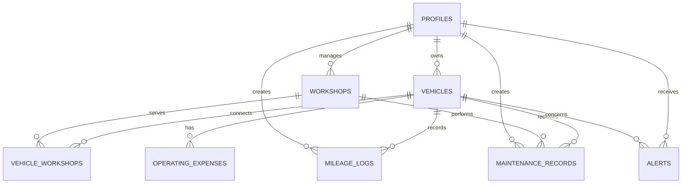

# Entity Relationship Diagram

## Relationship rationale

The many-to-many `vehicle_workshops` table is central: it models the owner choosing a workshop and authorizes workshop–owner record sharing. It is not merely a directory favorite.

