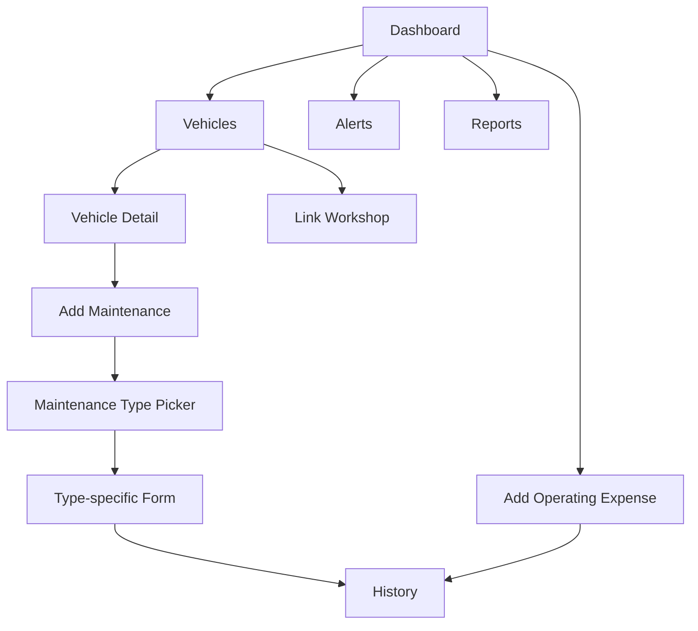

# Navigation Flow

Mobile bottom navigation: **Home**, **Vehicles**, central **Add**, **History**, **More**. Desktop uses the same sections in a sidebar.

The Add action opens: **Maintenance**, **Operating Expense**, or **Mileage**. Mechanics select an owned workshop before choosing a linked vehicle and maintenance type.

